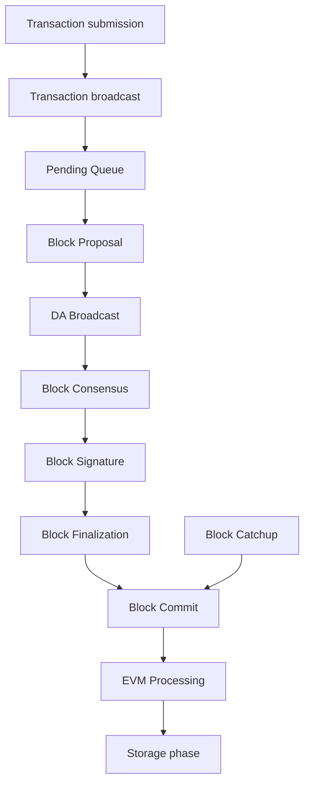
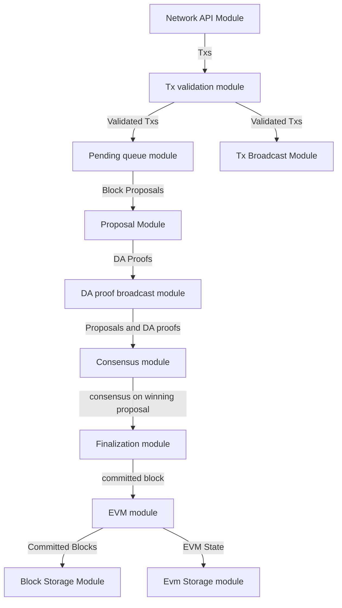

# 1. SKALE Consensus Overview

A SKALE chain is composed of `N` network `nodes` that process `transactions`. 

SKALE consensus is a provably secure algorithm that is used by SKALE chains to order `transactions` into `blocks`.

## 2. Consensus Architecture

## 2.1 Consensus Phases

During consensus for a particular `blockId` each `node` goes through the following phases

* _submission phase_ : accept and validate user `transactions` 
* _broadcast phase_ : broadcast `transactions` to peer nodes 
* _pending queue phase_: store `transactions` into `pending queues` 
* _block proposal phase_: create `block proposal` for each `block number` and broadcast it to peers, collecting `2/3 N` `data availability signatures` and creating `DA proofs`. 
* _DA broadcast phase_: broadcast `DA proofs` to peers
* _block consensus phase_: run `block consensus` for each `block proposal` to select a `winning proposal`
* _block signature phase_: sign `block signature share` (statement that states which proposal won). Broadcast `block signature share` to other nodes. Wait until receipt of 2/3 of `block signature shares`. Merge `block signature shares`  into `block signature`. 
* _block finalization phase_: commit the `winning proposal` if this `node` has it in storage. Otherwise download `winning proposal` from other nodes. The `winning proposal` becomes a`committed block` 
* _EVM processing phase_: process the `committed block` through `Ethereum Virtual Machine` to transition to the new `EVM state`. 
* _storage phase_: store `committed blocks` and `EVM state`

## 2.2 Typical transaction flow

The diagram below illustrates typical transaction flow:

## 2.3 Normal block processing vs catchup.

In addition to normal block processing, a node can receive blocks through `block catchup` mechanism.

`Block catchup` means that the `node` does not participate in `block consensus`. Instead, it simply downloads  `committed blocks` from other `nodes`, verifying `block signatures`. `Block catchup` typically happens when:

*  a node is powered on after being offline,
*  the nework connection of the node is slower than 2/3 of other nodes, so they reach consensus without the node participating.

  Block catchup` is also be used by `achive nodes` that do not participate in `core chain`.

On core nodes `block consensus` and `block catchup` run in parallel. This means that every node in addition to normal `block consensus` procedure makes periodic random connections to other nodes, to attempt to download ready committed blocks.

## 2.4 Skaled agent overview

Each `node` runs `skaled`, SKALE software PoS blockchain agent. 

`skaled` is composed of:

* `Network API module` accepts `transactions` and user requests.
* `Transaction validation module` validates `transactions` on receipt.
* `Pending queue module` holds `transactions`.
* `Transaction broadcast module` broadcasts `valid transactions` to other `nodes` in the chain
* `Proposal module` creates `block proposals` for consensus
* `Proposal broadcast module` broadcasts `block proposals` to peers and collects `DA proofs`
* `DA proof broadcast module` broadcasts `DA proofs` to peers
* `Consensus module` selects the winning `block proposal` and turns it into a `committed block`, and then creates `block signature` by assembling `signature shares`.
* `Finalization module` downloads winning proposals from other `nodes`, if a node does not have a copy of winning proposal by completion `block consensus`.
* `EVM module` processes the `committed block`
* `Block storage module` stores `committed blocks`, deleting old blocks if `skaled` runs out of block storage space (`block rotation`)
* `State storage module` stores EVM state.  State information is _never deleted automatically_. Cleaning up the state is the responsibility of dapps

# 3 Consensus specification

## 3.1 Security assumptions

SKALE is _provably secure_. This means one can prove two qualities of the blockchain

* _consistency_ - for any `block number`, `committed blocks` and `EVM state` are identical on each `node`.  Note, that due to network delays,
some `nodes` may at a given moment have less `committed blocks` than others. Therefore, `the consistency is eventual`.
* _liveliness_ - the blockchain will always keep producing new `committed blocks`. 

Provable security means that _under certain mathematical assumptions_, SKALE chain _will always be  consistent and lively, no matter what the attacker does_.

The mathematical assumptions for provable security are specified below.

### 3.1.1. Node security assumptions 

We assume that out of `N` `nodes`, `t` `nodes` at maximum are Byzantine (malicious), where

`3t+1 < = N`

Simply speaking, not more than 1/3 of nodes can be malicious. For instance, if `N = 16`, the maximum number of malicious `nodes` is `5`.

The identity of malicious nodes is not known. A malicious node will typically pretend being an honest node.

A malicious node will attempt to break the consistency and liveliness of the network by sending malicious messages, or not sending 
any messages, when it supposed to send a message by a protocol.

It is assumed that `malicious nodes` do not control network routers and links. This means that `malicious nodes` can not affect `messages` sent between `honest nodes`, such as corrupting or reordering them.

# 3.1.2 Network security assumptions

The algorithms used by SKALE make assumptions about _the properties of the underlying network_.

SKALE assumes that _the network is asynchronous and reliable with eventual delivery guarantee_.

This means that:

* `nodes` are assumed to be connected by _reliable communication links_. 
* Links can can be arbitrarily slow, but will eventually deliver `messages`.

The asynchronous model described above is _similar to the model assumed by Bitcoin and Ethereum blockchains_. It reflects *the state of modern Internet*, where temporary network splits and interruptions are normal, but always resolve eventually.

Since real Internet sometimes drops messages on the way without delivering them, _the eventual delivery guarantee is achieved in practice by retransmissions_. The `sending node` will make _multiple attempts to transfer_  `message` to the `receiving node`, until the transfer is successful and is confirmed by the `receiving node`.

## 3.2 Node priority

For each `block id` each `node` is assigned priority. The priority is used to determine the winner of consensus.

Node priority changes in a round-robin fashion from one block to another. For the first block, the first node has the highest priority or is a `priority leader`. For the second block the second node is the `priority leader` and so on.

In general, node priority can be expressed by the following formula

`nodePriority = N - ((nodeIndex - blockId ) mod N)`

Where `nodeIndex` is the integer index of the node in the chain from `1` to `N`.  As an example: for `blockId = 5` and `N = 16`, node `5` has priority `16`, node `6` has priority `15` and so on, ending with node `4` having priority `1`.

It is easy to see from the above expression, that 

`priorityLeader = ((nodeIndex - blockId )) mod N + 1`

## 3.3 Default block

Sometimes (very infrequently) no node wins consensus. In such cases, block consensus can result in an empty block that no-one proposed, named `default block`.

## 3.4 Full and Optimized Block Consensus

For each block, nodes need to propose and agree on a block. This is referred to as `block consensus`.

SKALE utilizes two types of block consensus: `full consensus` and `optimized consensus`.

During `full consensus`, all nodes compete to propose and create a block.  The winner is determined by competition. If there are multiple potential winners the ultimate winner is selected by _choosing the highest priority node_ out of the candidates.

During optimized consensus, only the winner of the previous consensus at `blockId = currentBlockId - N` is allowed to propose and win. This saves lots of network bandwidth. Essentially the purpose of the optimized consensus is to let previous winner win.

As an example, for block `18` the winner of the consensus at block `2` is allowed to propose and win.

The full consensus will run for first `N` blocks, and then will be re-run every `4 N + 1` blocks (65 blocks). The reason to re-run the full consensus is to see if network conditions changed. For most blocks, optimized consensus will run that will utilize the previous winner.

Full comsensus will also rerun if there is no previous winner, meaning that previous consensus ended with a default block.

## 3.5 Consensus phases

### 3.5.1 Submission phase

During submission phase a `user client` (browser or mobile app) signs a `transaction` using user `private wallet key` and submits it either directly to one of `core nodes` or to a `network proxy` or an archive node. A `network proxy` is a node that load balances incoming transactions to `core nodes` attempting to load them evenly, and avoiding transaction submissions to non-responsive nodes. An archive node is a node that does not participate in consensus, but stores a historic copy of the state as well as can broadcast transactions to 
core nodes.

### 3.5.2 Broadcast phase

During the broadcast phase, a `core node` or an `archive node` that received a `transaction` from `user client` will broadcast it to all `core nodes`. 

### 3.5.3 Pending queue phase

A `transaction` received from `user client` or from `transaction broadcast` is validated and placed into the`pending queue`.
During the validation, `transaction signature` and format are verified. 

`Pending queue` has fixed memory capacity. If the `pending queue` is full, adding a new `transaction` to the `queue` will cause some `transactions` to be dropped from the `pending queue`. Ethereum-compatible blockchains, including SKALE, drop transactions habing the smallest `gas price`.

Pending queues on different core nodes will typically look similar but not identical due to network delays.

### 3.5.4 Block proposal phase (full consensus)

For each `block id`, _each SKALE node_ will form a `block proposal`.  A `block proposal` is an ordered list of `transactions`.

If all `transactions` in `pending queue` can be placed into proposal without reaching `block gas limit`, then all `transactions` will be placed into `block proposal`. Otherwise, `transactions` with higher gas price will be selected from the queue to create a `block proposal` that fits the `block gas limit`. 

Once a `node` created a proposal, it will broadcast `compressed proposal` to all its nodes. The compressed proposal includes only the `transaction hash` (fingerprint) of each transaction. The `receiving node` decompresses `transactions` by matching `transaction hashes` to `transactions` stored in is pending queue. In the event `receiving node` does not have a matching `transaction` in its pending queue, it will ask the `sending node` for the entire `transaction`.

Once the `receiving node` receives the `block proposal`, it will sign a `Data Availability Signature` and pass it to the `sending node`. 

Once the `sending node` collects `DA signatures` from `2/3` of nodes, it will merge the signatures into a `DA proof`. The `DA proof` proves that the proposal has been widely distributed over the network.

### 3.5.4 Block proposal phase (optimized consensus)

For optimized consensus only the `previos winner` will form and broadcast a proposal, and collect a `DA proof` for it.

### 3.5.5 DA broadcast phase

Once a `node` obtains a `DA proof` for its `block proposal`, it will broadcast `DA proof` to other nodes.

Note that `DA proof` requirement solves two problems:

First, a `block proposal` that has a `DA proof` is _guaranteed to be widely distributed_.

Second, since `DA proof` creation requires a 2/3 signature of nodes, the proposal is _guaranteed to be unique_. 
A malicious node is not able to create two different proposals an obtain DA proofs for both of them.

### 3.5.6 Block consensus phase (full consensus)

Once a node receives `DA proofs` from 2/3 of nodes, the node will start the block consensus phase. It will also start block consensus phase if a `proposal timeout` is reached, even with less than 2/3 proofs.

During block consensus phase, the `node` will vote `1` if it received `DA proof` for a particular proposal, and vote `0` otherwise.

The nodes will then executed asynchronous binary consensus algorithm, also known as `Byzantine Generals problem`. https://en.wikipedia.org/wiki/Byzantine_fault

The particular binary consensus algorithm implemented in SKALE is specified in 

https://inria.hal.science/hal-00944019/file/RR-2016-Consensus-optimal-V5.pdf

Once the binary consensus completed, it guarantees that all honest node will reach consensus of `1` or `0'. If honest nodes reach `1` it is guaranteed
that `1` was initially voted by at least one honest node. That, in turn, guarantees that the `block proposal` is `DA safe`, or that it is widely distributed over the network.

If a `block consensus` phase outputs `1` for several proposals, _the proposal with highest priority is selected_.  In a rare case where consensus reports all zeroes, a `default block` is committed.

### 3.5.7 Block consensus phase (optimized consensus)

For optimized consensus the node waits for a `DA proof` from the `previous winner`, and then starts a single binary consensus voting `1'. In normal case, this will result in all honest nodes voting `1` and binary consensus resulting in `1`, which leads to committal of the block from `previous winner`.

If `block proposal timeout` is reached, the node will start binary consensus voting `0`. This will typically happen if `previos winner` crashed and did not submit a proposal. In such a rare case, all honest nodes will normally vote `0`. This will lead to binary consensus resulting in `0`. In such a case, a `default block` is committed.

### 3.5.7  Block  signature phase

After `block consensus` decides on the winning block, each node will sign the statement specifying the winning proposal (`block signature share`) and broadcast it to other nodes. The node will then wait until receipt of 2/3 of `block signature shares` and merge the shares into `block signature`.

==== Block  finalization phase.

On completion of _block signature phase_, all honest nodes will have the `block signature` but some of them may not have the block itself. 

This can happen due to a malicious proposer, that intentionally does not send its proposals to some of the all nodes in order to break the liveliness property of the blocklchain. It can also happen due to proposer crashing, or due to slow network.

Fortunately, `DA proof` requirement solves the problem.  It is guaranteed, that `block proposal` that wins _block consensus phase_ has `DA proof`, and is, therefore, widely distributed across the network.

Therefore, during _block finalization_phase_ If a `node` does not happen to have the `winning proposal`, it will simply connect to other `nodes` to download it from them. 

Note that 2/3 of the nodes are guaranteed to have a copy of the proposal after _DA proof phase_

### 3.5.8  EVM processing phase

After block finalization the committed block is present on the node

The node will  remove the matching transactions from the transaction queue.

The block will be then processed through Ethereum Virtual Machine to update `EVM state`.

### 3.5.9  Storage phase

`Committed block` will now be stored in persistent storage, and 
`EVM state` will be updated in persistent storage.

The node will move into _block proposal phase_ for the next block.

# 4. Behavior in case of network failures and crashes

## 4.1 Achieving eventual delivery by retransmissions

Since real Internet sometimes drops messages on the way without delivering them, _the eventual delivery guarantee is achieved in practice by retransmissions_. The `sending node` will make _multiple attempts to transfer_  `message` to the `receiving node`, until the transfer is successful and is confirmed by the `receiving node`.

Each `sending node` maintains a separate `outgoing message queue` for each `receiving node`. To schedule a `message` for delivery to a particular node, `message` is placed into the corresponding `outgoing message queue`.

Each `outgoing message queue` is serviced by a separate program `thread`. The `thread` reads `messages` from the `queue` and attempts to transfer them to the `destination node`. If the `destination node` temporarily does not accept `messages`, the `thread` will keep initiating transfer attempts until the `message` is delivered. The `destination node` can, therefore, temporarily go offline without causing `messages` to be lost.

Since there is a dedicated `message sending thread` for each `destination node`, `messages` are sent independently. Failure of a particular `destination node` to accept `messages` will not affect receipt of `messages` by other `nodes`.

In the remainder of this document, anywhere where it is specified that a `message` is sent from `node` `A` to `B`, we mean reliable independent delivery as described above.

## 4.2 Consensus state

Each node stores _consensus state_. For each round of consensus, consensus state includes the set of proposed blocks, as well as the state variables of the protocols used by the consensus round.

The state is stored in non-volatile memory and preserved across reboots.

## 4.3 Reboots and crashes

During `_A_`, a node will temporarily become unavailable. After a reboot, messages destined to the node will be delivered to the node. Therefore, a reboot does not disrupt operation of asynchronous consensus.

Since consensus protocol state is not lost during a reboot, a node reboot will be interpreted by its peers as a temporarily slowdown of network links connected to the node.

A is an event, where a node loses all of parts of the consensus state. For instance, a node can lose received block proposals or values of protocol variables.

A hard crash can happen in case of a software bug or a hardware failure. It also can happen if a node stays offline for a very long time. In this case, the outgoing message queues of nodes sending messages to this node will overflow, and the nodes will start dropping older messages. This will lead to a loss of a protocol state.

## 4.4 Default queue lifetime

This specification specifies one hour as a default lifetime of a message which has been placed into an outgoing queue. Messages older than one hour may be dropped from the message queues. A reboot, which took less than an hour is, therefore, guaranteed to be a a normal reboot.

## 4.5 Limited hard crashes

Hard crashes are permitted by the consensus protocol, as long as not too many nodes crash at the same time. Since a crashed node does not conform to the consensus protocol, it counts as a Byzantine node for the consensus round, in which the state was lost. Therefore, only a limited number of concurrent hard crashes can exist at a given moment in time. The sum of crashed nodes and byzantine nodes can not be more than `t` in the equation (1). Then the crash is qualified as a limited hard crash.

During a limited hard crash, other nodes continue block generation and consensus. The blockchain continues to grow. When a crashed node is back online, it will sync its blockchain with other nodes using a catchup procedure described in this document, and start participating in consensus.

## 4.6 Widespread crashes

A widespread crash is a crash where the sum of crashed nodes and Byzantine nodes is more than $t$.

During a _widespread crash_ a large proportion of nodes or all nodes may lose the state for a particular round and consensus progress may stall. The blockchain, therefore, may lose its liveliness.

Security of the blockchain will be preserved, since adding a new block to blockchain requires a supermajority threshold signature of nodes, as described later in this document.

The simplest example of a widespread crash is when more than 1/3 of nodes are powered off. In this case, consensus will stall. When the nodes are back online, consensus will start working again.

In real life, a widespread crash can happen due to to a software bug affecting a large proportion of nodes. As an example, after a software update all nodes in an schain may experience the same bug.

## 4.7 Failure resolution protocol

In a case of a catastrophic failure a separate failure resolution protocol is used to restart consensus.

First, nodes will detect a catastrophic failure by detecting absence of new block commits for a long time.

Second, nodes will execute a failure recovery protocol that utilizes Ethereum main chain for coordination. Each node will stop consensus operation. The nodes will then sync their blockchains replicas, and agree on time to restart consensus.

Finally, after a period of mandatory silence, nodes will start consensus at an agreed time point in the future.

# 5. Data structures format

## 5.1 Transactions

Each user transaction `T` is assumed to be an Ethereum-compatible transaction, represented as a sequence of bytes.

## 5.2 Block

Each block is a byte string, which includes a header followed by a body.

## 5.2.1 Block header

Block header is a JSON object that includes the following:

. `*BLOCK~ID~*` - integer id of the current block, starting from 0 and incremented by 1
. `*BLOCK PROPOSER*` - integer id of the node that proposed the block.
. `*PREVIOUS BLOCK HASH*` - SHA-3 hash of the previous block
. `*CURRENT BLOCK HASH*` - the hash of the current block
. `*TRANSACTION COUNT*` - count of transactions in the current block
. `*TRANSACTION SIZES*` - an array of transaction sizes in the current block
. `*CURRENT BLOCK PROPOSER SIG*` - ECDSA signature of the proposer of the current block
. `*CURRENT BLOCK T~SIG~*` - BLS supermajority threshold signature of the current block

Note: All integers in this spec are unsigned 64-bit integers unless specified otherwise.

## 5.2.2 Block body

`BLOCK BODY` is a concatenated transactions array of all transactions in the block.

## 5.2.3 Blockhash

Block hash is calculated by taking 256-bit Keccack hash of block header concatenated with block body, while omitting `CURRENT BLOCK HASH`, `CURRENT BLOCK SIG`, and `CURRENT BLOCK TSIG` from the header. The reason why these fields are omitted is because they are not known at the time block is hashed and signed.

Note: Throughout this spec we use SHA-3 as a secure hash algorithm.

## 5.2.4 Block verification

A node or a third party can verify the block by verifying a threshold signature on it and also verifying the previous block hash stored in the block. Since the threshold signature is a supermajority threshold signature and since any honest node will only sign a single block at a particular block ID, no two blocks with the same block ID can get a threshold signature. This provides security against forks.

## 5.3 Block proposal

A block starts as a block proposal. A block proposal has the same structure as a block, but has the threshold signature element unset.

Node concurrently make proposals for a given block ID. A node can only make one block proposal for a given block ID.

Once a block proposal is selected to become a block by consensus, it is signed by a supermajority of nodes. A signed proposal is then committed to the end of the chain on each node.

=== Compressed block proposal communication

Typically pending queues of all nodes will have similar sets of messages, with small differences due to network propagation times.

When node `*A*` needs to send to node `*B*` a block proposal `*P*`, `*A*` does need the send the actual transactions that compose `*P*`. `*A*` only needs to send transaction hashes, and then `*B*` will reconstruct the proposal from hashes by matching hashes to messages in its pending queue.

In particular, for each transaction hash in the block proposal, the
receiving node will match the hash to a transaction in its pending
queue. Then, for transactions not found in the pending queue, the
receiving node will send a request to the sending node. The sending node
will then send the bodies of these transactions to the receiving node.
After that the receiving node will then reconstruct the block proposal.

== Consensus data structures and operation

=== Consensus rounds

New blocks a created by running consensus rounds. Each round corresponds
to a particular `*BLOCK~ID~*`.

At the beginning of a consensus round, each node makes a block proposal.

When a consensus round completes for a particular block, one of block
proposals wins and is signed using a supermajority signature, becoming a
committed block.

Due to a randomized nature of consensus, the is a small probability that
consensus will agree on an empty block instead of agreeing on any of the
proposed blocks. In this case, an empty block is pre-committed to a
blockchain.

=== Catchup agent

There are two ways, in which blockchain on a particular node grows and
`*TIP~ID~*` is incremented:

Normal consensus operation: during normal consensus, a node constantly
participates in consensus rounds, making block proposals and then
committing the block after the consensus round commits.

Catchup: a separate catchup agent is continuously running on a node. The
catchup engine is continuously making random sync connections to other
nodes. During a sync both nodes sync their blockchains and block
proposal databases.

If during catchup, node `*A*` discovers that node `*B*` has a larger value
of `*TIP~ID~*`, `*A*` will download the missing blocks range from `*B*`, and
commit it to its chain after verifying supermajority threshold
signatures on the received blocks.

Note that both normal and catchup operation append blocks to the
blockchain. The catchup procedure intended to catchup after hard
crashes.

When the node comes online from a hard crash, it will immediately start
participating in the consensus for new blocks by accepting block
proposals and voting according to consensus mechanism, but without
issuing its own block proposals. Since a block proposal requires hash of
the previous block, a node will only issue its own block proposal for a
particular block id once it a catch up procedure moves the `*TIP~ID~*` to
a given block id.

Liveliness property is guaranteed under hard crashes if the following is
true: normal consensus guarantees liveliness properly, catch-up
algorithm guarantees eventual catchup, and if the number of nodes in a
hard crashed state at a given time plus the number of Byzantine nodes is
less or equal `*N ⅓*`.

Since the normal consensus algorithm is resilient to having latexmath:[\frac{N-1}{3}]
Byzantine nodes, normal consensus will still proceed if we count crashed
nodes as Byzantine nodes and guarantee that the total number of
Byzantine nodes is less than latexmath:[\frac{N-1}{3}]. When a node that crashed joins
the system back, it will immediately start participating in the new
consensus rounds. For the consensus rounds that it missed, it will use
the catchup procedure to download blocks from other nodes.

== Normal consensus operation

=== Block proposal creation trigger

A node is required to create a block proposal directly after its
`*TIP~ID~*` moves to a new value. `*TIP~ID~*` will be incremented by $1$
once a previous consensus round completes. `*TIP~ID~*` will also move, if
the catchup agent appends blocks to the blockchain.

=== Block proposal creation algorithm

To create a block a node will:

. examine its pending queue,

. if the total size of of transactions in the pending queue `TOTAL SIZE` is less or equal than `MAX BLOCK SIZE`, fill in a block proposal by taking all transactions from the queue,

. otherwise, fill in a block proposal by of `MAX BLOCK SIZE` by taking transactions from oldest received to newest received,

. assemble transactions into a block proposal, ordering transactions by sha-3 hash from smallest value to largest value,

. in case the pending queue is empty, the node will wait for `BEACON TIME` and then, if the queue is still empty, make an empty block proposal containing no transactions.

Note that the node does not remove transactions from the pending queue
at the time of proposal. The reason for this is that at the proposal
time there is no guarantee that the proposal will be accepted.

`MAX BLOCK SIZE` is the maximum size of the block body in bytes.
Currently we use `MAX BLOCK SIZE = 8 MB`. FUTURE: We may consider
self-adjusting block size to target a particular average block commit
time, such as `1s`.

`BEACON TIME` is time between empty block creation. If no-one is
submitting transactions to the blockchain, empty beacon blocks will be
created. Beacon blocks are used to detect normal operation of the
blockchain. The current value of `BEACON TIME` is `3s`.

=== Block proposal reliable communication algorithm

Once a node creates a block proposal it will communicate it to other
nodes using the data data availability protocol described below.

The data availability protocol guarantees that if the the protocol
completes successfully, the message is transferred to the supermajority
of nodes.

The five-step protocol is described below:

1.  Step 1: the sending node `*A*` sends the proposal `*P*` to all of its
    peers

2.  Step 2: each peer on receipt of `*P*` adds the proposal to its
    proposal storage database `PD`

3.  Step 3: the peer than sends a receipt to back to `*S*` that contains a
    threshold signature share for `*P*`

4.  Step 4: `*A*` will wait until it collects signature shares from a
    `supermajority` of nodes (including itself) `*A*` will then create a
    supermajority signature `*S*`. This signature serves as a receipt that
    a supermajority of nodes are in possession of `*P*`

5.  Step 5: `*A*` will send the supermajority signature to each of the
    nodes.

_Data Availability Receipt Requirement_ In further consensus steps, any
node voting for proposal `*P*` is required to include `*S*` in the vote.
Honest nodes will ignore all votes that do not include the supermajority
signature `*S*`.

The protocol used above guarantees data availability, meaning that any
proposal `*P*` that wins consensus will be available to any honest nodes.
This is proven in steps below.

Liveliness. If `*A*` is honest, than the five-step protocol above will
always complete. By completion of the protocol we mean that all honest
nodes will receive `*S*`. Byzantine nodes will not be able to stall the
protocol.

By properties of the send operation discussed in Section 1.2 all sends
in Step 1-3 are performed in parallel. In step 4 node `*A*` waits to
receive signature shares for the supermajority of nodes. This step will
always take fine time, even if Byzantine nodes do not reply. This comes
from the fact that there is a supermajority of honest nodes. In step 5
`*S*` will be added to outgoing message queues of all nodes. Since honest
nodes do accept messages, `*S*` will ultimately be delivered to all honest
nodes as described in Section 1.2.

If a proposal has a supermajority signature, it is was communicated to
and stored on the simple majority of honest nodes.

The proof directly follows from Lemma 3, and from the fact that an
honest node `*B*` only signs the proposal after `*B*` has received and
stored the proposal.

If a proposal wins consensus and is to be committed to the blockchain,
then any honest node `*X*` that does not have the proposal can efficiently
retrieve it.

First, a proposal will not pass consensus without having a supermajority signature. This comes from the fact that all nodes voting for the proposal will need to include `*S*` in the vote.

By the properties of binary Byzantine agreement protocol of Mostéfaoui at al., a proposal can win consensus only if at least one honest node votes for the proposal. A proposal without a signature will never win consensus, since an honest node will never vote for it.

Therefore, if a proposal won consensus, it is guaranteed to have a supermajority signature.

Second by previous lemma, if a proposal has a supermajority signature, any honest node can retrieve it. This completes the proof.

The protocol discussed above is important because it guarantees that if a proposal wins consensus, all honest nodes can get this proposal from other honest nodes and add it to the blockchain.

=== Pluggable Binary Byzantine Agreement

The consensus described above uses an Asynchronous Binary Byzantine Agreement (ABBA) protocol (ABBA). We currently use ABBA from Mostéfaoui et. all. Any other ABBA protocol `*P*` can be used, as long as it has the following properties

.  Network model: `*P*` assumes asynchronous network messaging model described in Section 1.2

.  Byzantine nodes: `*P*` assumes less than one third of Byzantine nodes, as described by Equation (1).

.  Initial vote: `*P*` assumes, that each node makes an initial vote `yes(1)` or `no(0)`.

.  Consensus vote: `*P*` terminates with a consensus vote of either `yes` or `no`, where if the consensus vote is `yes`, its is guaranteed that at least one honest node voted yes.

Note that, an ABBA protocol typically outputs a random number `*_COMMON COIN_*` as a byproduct of its operation. We use this `*_COMMON COIN_*` as a random number source.

=== Consensus round

A consensus round `*R*` is executed for each `*BLOCK~ID~*` and has the following properties:

.  For each `*R*` nodes will execute `*N*` instances of ABBA.

.  Each `*ABBA~i~*` corresponds to a vote on block proposal from the node `*i*`

.  Each `*ABBA~i~*` completes with a consensus vote of `yes` or `no`

.  Once all `*ABBA~i~*` complete, there is a vote vector `*v~i~*`, which
    includes `yes` or `no` for each proposal.

.  If there is only one `yes` vote, the corresponding block proposal
    `*P*` is committed to the blockchain

.  If there are multiple `yes` votes, `*P*` is pseudo-randomly picked from
    the `yes`-voted proposals using pseudo-random number `*R*`. The
    winning proposal index the remainder of division of `*R*` by
    $n_~win~$, where $n_~win~$ is the total number of `yes` proposals.

.  The random number `*R*` is the sum of all ABBA `*_COMMON COIN_*`.

.  In the rare case when all votes are `no`, an empty block is
    committed to the blockchain. The probability of an all-no vote is
    very small and decreases when `*N*` increases. This is analyzed in
    detail in the following sections.

Liveliness: each consensus round `*R*` will always produce a block in a
finite time.

The proof follows from the fact that each `*R*` runs `*N*` parallel versions
of `*ABBA*` binary consensus, and from the liveliness property of the
`*ABBA*` consensus

Consistency: each consensus round will produce the same result `*P*` on
all nodes

This follows from the consistency property of the ABBA consensus and
from the fact that the consensus round algorithm is deterministic and
does not depend on the node where it is executed.

Data Availability: the winning proposal `*P*` is available to any honest
node.

This follows from the fact, that ABBA will not return consensus `yes`
vote unless at least one honest node initially votes `yes`, and from the
fact that an honest node will not vote `yes` unless it has a data
availability proof (threshold signature `*S*`).

== Consensus round vote trigger

Each node `*A*` will vote for ABBAs in a consensus round `*R*` immediately
after proposal phase completes, meaning that two processes complete:

1.  `*A*` receives a supermajority of block proposals for this round,
    including data availability signatures

2.  `*A*` transmits its block proposal to a supermajority of nodes

Liveliness: the block proposal phase will complete in finite time, and
the node will proceed with voting

Indeed, since a supermajority of nodes are honest, and since every
honest node sends its block proposal and data availability signature to
all other nodes, at some point in time `*A*` will receive proposals and
data availability signatures from a supermajority of nodes.

Also, since a supermajority of destination nodes are honest, at some
point in time the node will transmit its block proposal to a
supermajority of nodes.

It will vote `yes` for each block proposal that it received, and `no`
for each block proposal that it did not receive.

Vote of each honest node will include latexmath:[\frac{2N+1}{3}] `yes` votes and
latexmath:[\frac{2N-1}{3}] `no` votes

This simply follows from the fact, that node `*A*` votes immediately after
receiving a supermajority of block proposals, and from the fact that `*A*`
votes yes for each block proposal that it received

== Finalizing Winning Block Proposal

Once consensus completes on a particular node `*A*` and the winning block
proposal, the node will execute the following algorithm to finalize the
proposal and commit it to the chain.

. `*A*` will check if it has received the winning proposal `*P*`

. if `*A*` has not received the proposal, it will download it from its peer nodes using the algorithm described later in this document. It is possible to do it because of Lemma 11.

. `*A*` will then sign a signature share for `*P*` and send it to all other nodes

. `*A*` will then wait to receive signature shares from a supermajority of nodes, including itself

. Once `*A*` has received a supermajority of signature shares, it will combine them into a threshold signature.

. `*A*` will then commit the `*P*` to the blockchain together with the threshold signature of `*P*`

The proposal download algorithm is specified below. The proposal assumes
that the proposal is split in $N-1$ chunks of equal size
latexmath:[\left\lceil \frac{size(P)}{N-1} \right\rceil], except the last chunk the size of
which will be the remainder of latexmath:[\frac{size(P)}{N-1}].

The purpose of the algorithm is to minimize network traffic.

. `*A*` sends a message to each peer `*i*` , requesting for chunk `*i*`
. `*A*` waits until it receives a `supermajority - 1` of responses
. `*A*` then enumerates missing chunks
. `*A*` then randomly assigns each missing chunk to a servers, and empty chunks to each server that did not get a missing chunk assigned, and sends the corresponding requests to each server.
. `*A*` waits until receives `supermajority -1` of responses
. If `*A*` received all chunks, the algorithm is complete. Otherwise it goes back to step 3.

