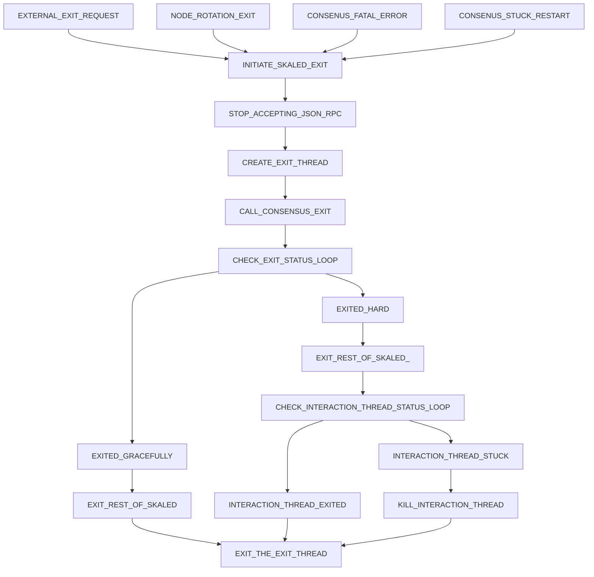

# Sync Node Spec

# Intro

A graceful way to exit skaled is on a block boundary at the moment, when a block is processed by 
skaled and ConsensusExtFace::createBlock() function returns.

Gracefull exit guarantees that consensus is will not be corrupt and blocks
have been processed correctly by EVM.

The goal of this specification is to achieve gracefull exit in most cases. 
# Exit procedure 
## Exit procedure state diagram

The following diagram describes skaled exit procedure

## Exit procedure initiation 

Exit procedure may be initiated by 

* EXTERNAL_EXIT_REQUEST - external exit request, such a terminate signal
* EXTERNAL_EXIT_REQUEST - node rotation exit, where skaled self-exits to reload the config
* CONSENUS_FATAL_ERROR - a fatal error occurs in consensus, and consensus requests skaled 
  to restart
* CONSENUS_STUCK_RESTART - consensus determines that it is stuck and request skaled to restart

Once the exit is initiated, skaled goes into INITIATE_SKALED_EXIT state.

## Exit procedure beginning steps

Once the exit procedure is initiated, the following steps must be performed by skaled

* CREATE_EXIT_THREAD - create a separate detached SkaledExitThread. All further steps are 
performed from this thread
* STOP_ACCEPTING_JSON_RPC - stop accepting JSON-RPC requests except for the status calls.
* CALL_CONSENSUS_EXIT - call exitGracefully() on consensus. The consensus will first try to
  exit on block boundary, and then after a timeout will do the hard exit.
* CHECK_EXIT_STATUS_LOOP - after calling exitGraceFully(), SkaledExitThread must  keep 
  calling  ConsensusExtFace::getStatus()
* When the status becomes CONSENSUS_EXITED_HARD or 
  CONSENSUS_EXITED_GRACEFULLY, the SkaledExitThread will perform steps described in the 
  next sections

## Procedure after CONSENSUS_EXITED_GRACEFULLY

If status is CONSENSUS_EXITED_GRACEFULLY, all consensus threads will terminate. 

ExitThread will then do the following steps

* EXIT_REST_OF_SKALED -  exit all other threads in skaled, and then exit itself.
* EXIT_THE_EXIT_THREAD - ExitThread will exit iself as the last step. 

## Procedure after CONSENSUS_EXITED_HARD

### SkaledInteractionThread

Consensus maintains a single detached thread, SkaledInteractionThread to call the following 
functions 

* ConsensusExtFace::createBlock()
* ConsensusExtFace::pendingTransactions()

When consensus status returns CONSENSUS_EXITED_HARD, it guarantees to terminate all consensus 
threads except
the SkaledInteractionThread. 

If SkaledInteractionThread is stuck inside ConsensusExtFace::createBlock(), 
consensus will not hard kill it.  This is done in order to give EVM a chance to complete block 
processing.

### SkaledInteractionThread termination

To hard terminate SkaledInteractionThread, there is a separate function

* ConsensusExtFace::killSkaledInteractionThread()

### Steps after CONSENSUS_EXITED_HARD

If after a call to exitGracefully() SkaledExitThread gets CONSENSUS_EXITED_HARD, then it must 
do the following steps:

* EXIT_REST_OF_SKALED_ - exit all other threads in skaled, including hard killing them if needed   
When all other threads exit, they will stop using memory and CPU, as well as release locks. 
At this point, if SkaledInteractionThread was stuck, it may get unstuck and finish block 
  processing.
* CHECK_INTERACTION_THREAD_STATUS_LOOP - SkaledExitThread should keep calling 
  ConsensusExtFace::getSkaledInteractionThreadStatus()
  for some time, to give SkaledInteractionThread a chance to complete blovk processing and 
* exit nicely. If the  status become EXITED, 
  then  SkaledExitThread should exit.
* If SkaledInteractiionThread is stuck and does not exit nicely, SkaledExitThread should call
  ConsensusExtFace::killSkaledInteractionThread() and then exit. 

# Description of exitGracefully() internal operation.

## Exit on block boundary

When exitGracefully() is called on consensus, consensus will try to exit on block boundary.

This works as follows:

* consensus will set an internal flag exitOnBlockBoundary
* when pushBlockToExtFace() function returns, it will check exitOnBlockBoundary and call 
  immediateExit() if the 
  flag  is true

There are two exceptions, where exitGracefully() will call immediateExit instead waiting
for block boundary

* fatal error previously occured in consensus
* consensus StuckMonitoringAgent says that consenus has been stuck
* consensus StuckMonitoringAgent says that less than 2/3 of nodes are alive on the network

Exit on block boundary guarantees exit of all consensus threads.

## Hard exit

If exit on block boundary is not triggered for
CONSENSUS_WAIT_TIME_BEFORE_HARD_EXIT_MS, which has default value of 30 seconds,
immediateExit() is called

## SkaledInteractionThread

If during hard exit SkaledInteractionThread is stuck in skaled, it will not be killed.
All other consensus threads are guaranteed to exit for hard exit.

