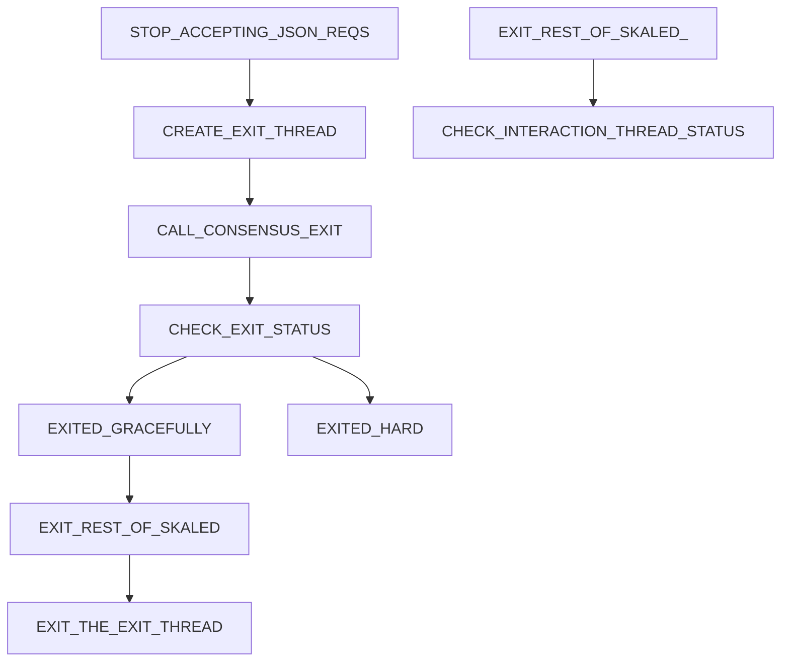

# Sync Node Spec

# Intro

The best way to exit skaled is at the moment when a block is processed by skaled and 
ConsensusExtFace::createBlock() function returns.

# Exit Procedure Diagram

## Diagram

Here is a simple flow chart:

## Standard exit procedure 

To initiate exit procedure, skaled need to do the following:

* Stop accepting JSON-RPC requests except for the status calls.
* create a separate detached SkaledExitThread to initiate the following steps 
* call exitGracefully() on consensus. 
* The consensus will first try it exit gracefully on return of ConsensusExtFace::createBlock() , 
  and then after  timeout will do the hard exit.
* After calling exitGraceFully(), SkaledExitThread will need to keep calling 
  ConsensusExtFace::getStatus()
* When the status becomes enum consensus_engine_status CONSENSUS_EXITED_HARD or 
  CONSENSUS_EXITED_GRACEFULLY, the SkaledExitThread will:

* If status is CONSENSUS_EXITED_GRACEFULLY, all consensus threads will terminate. ExitThread then needs to 
  exit all other threads in skaled, and then exit itself.
* If status is CONSENSUS_EXITED_HARD, skaled needs to use the procedure described in the next 
  section

## Hard exit

Consensus maintains a single detached thread, SkaledInteractionThread to call the following 
functions 

* ConsensusExtFace::createBlock()
* ConsensusExtFace::pendingTransactions

When consensus does hard exit, it guarantees to terminate all consensus threads except
the SkaledInteractionThread. 

If SkaledInteractionThread is stuck inside ConsensusExtFace::createBlock(), 
consensus will not hard kill it.  This is done in order to give EVM a chance to complete block 
processing.

To hard terminate SkaledInteractionThread, there is a separate function

* ConsensusExtFace::killSkaledInteractionThread()

* If after a calle to exitGraceFully CONSENSUS_EXITED_HARD, skaled needs to

If after a call to exitGracefully() SkaledExitThread gets CONSENSUS_EXITED_HARD, then it needs 
to do the following:
* exit all other threads in skaled, including hard kill if needed   
* When all other threads exit, the will stop using memory and CPU, as well as release lock
* At this point, if SkaledInteractionThread was stuck, it may get unstuck and finish block 
  processing.
* SkaledExitThread should keep calling ConsensusExtFace::getSkaledInteractionThreadStatus()
  for INTERACTION_THREAD_HARD_EXIT_TIME. If the status become EXITED, then SkaledExitThread should 
  exit.
* After INTERACTION_THREAD_HARD_EXIT_TIME, SkaledExitThread should call
  ConsensusExtFace::killSkaledInteractionThread() and exit. 

