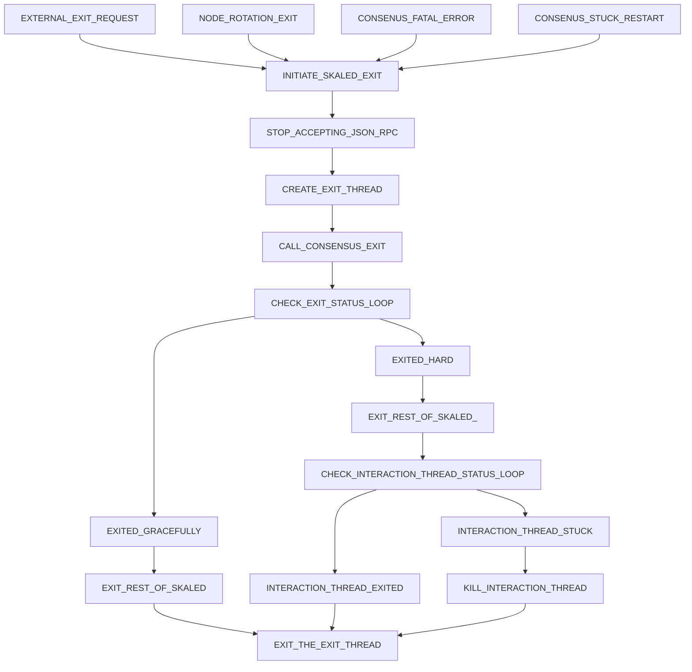

# Sync Node Spec

# Intro

The best way to exit skaled is at the moment when a block is processed by skaled and 
ConsensusExtFace::createBlock() function returns.

# Exit Procedure Diagram

## Exit state diagram

The following diagram describes skaled exit procedure

## Exit procedure initiation 

Exit procedure may be initiated by 

* EXTERNAL_EXIT_REQUEST - external exit request, such a terminate signal
* EXTERNAL_EXIT_REQUEST - node rotation exit, where a skaled self-exits to reload the config
* CONSENUS_FATAL_ERROR - a fatal error occurs in consensus, and consensus requests skaled 
  restart
* CONSENUS_STUCK_RESTART - consensus determines that it is stuck and request skaled for a restart

Once the exit is initiated, skaled goes into INITIATE_SKALED_EXIT state.

## Exit procedure beginning steps

Once the exit procedure is initiated, the following steps are performed by skaled

* STOP_ACCEPTING_JSON_RPC - stop accepting JSON-RPC requests except for the status calls.
* CREATE_EXIT_THREAD - create a separate detached SkaledExitThread to initiate the following steps 
* CALL_CONSENSUS_EXIT - call exitGracefully() on consensus. 
* The consensus will first try it exit gracefully on return of ConsensusExtFace::createBlock() , 
  and then after  timeout will do the hard exit.
* CHECK_EXIT_STATUS_LOOP - after calling exitGraceFully(), SkaledExitThread will need to keep 
  calling  ConsensusExtFace::getStatus()
* When the status becomes CONSENSUS_EXITED_HARD or 
  CONSENSUS_EXITED_GRACEFULLY, the SkaledExitThread will perform steps described in the 
  next sections

# Steps after CONSENSUS_EXITED_GRACEFULLY

If status is CONSENSUS_EXITED_GRACEFULLY, all consensus threads will terminate. 

ExitThread will then do the following steps

* EXIT_REST_OF_SKALED -  exit all other threads in skaled, and then exit itself.
* EXIT_THE_EXIT_THREAD - ExitThread will exit iself as the last step. 

# Steps after CONSENSUS_EXITED_HARD

Consensus maintains a single detached thread, SkaledInteractionThread to call the following 
functions 

* ConsensusExtFace::createBlock()
* ConsensusExtFace::pendingTransactions

When consensus does CONSENSUS_EXITED_HARD, it guarantees to terminate all consensus threads except
the SkaledInteractionThread. 

If SkaledInteractionThread is stuck inside ConsensusExtFace::createBlock(), 
consensus will not hard kill it.  This is done in order to give EVM a chance to complete block 
processing.

To hard terminate SkaledInteractionThread, there is a separate function

* ConsensusExtFace::killSkaledInteractionThread()

If after a call to exitGracefully() SkaledExitThread gets CONSENSUS_EXITED_HARD, then it needs 
to do the following steps:

* EXIT_REST_OF_SKALED_ - exit all other threads in skaled, including hard kill if needed   
When all other threads exit, they will stop using memory and CPU, as well as release locks 
At this point, if SkaledInteractionThread was stuck, it may get unstuck and finish block 
  processing.
* CHECK_INTERACTION_THREAD_STATUS_LOOP - SkaledExitThread should keep calling 
  ConsensusExtFace::getSkaledInteractionThreadStatus()
  for INTERACTION_THREAD_HARD_EXIT_TIME. If the status become EXITED, then SkaledExitThread should 
  exit.
* After INTERACTION_THREAD_HARD_EXIT_TIME, SkaledExitThread should call
  ConsensusExtFace::killSkaledInteractionThread() and exit. 

